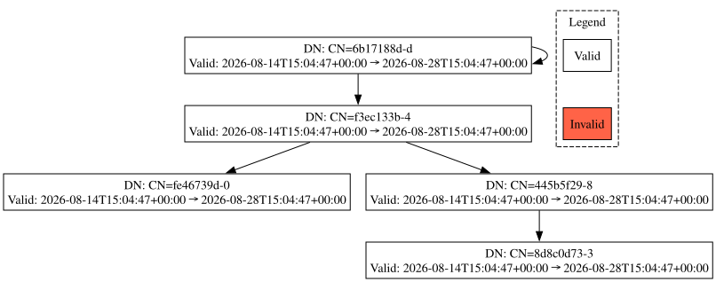

# certgraph

[](https://pypi.org/project/certgraph/)
[](https://certgraph.readthedocs.io/en/latest/?badge=latest)
[](LICENSE)

Python package for creating, exploring and displaying directed graphs of X.509 certificates.

Build a directed graph by importing PEM/DER/`x509.Certificate` objects using subject/issuer relationships. Explore the
generated digraph with the built in functions and then export the graph rendered in the DOT language.

Basic example graph generated to DOT source with `certgraph.export_dot()` and then rendered to SVG with `dot` command line tool:



## Features

* Import certificates from:
  * PEM strings (individually or whole PKIs)
  * DER bytes
  * `cryptography.x509.Certificate` objects
* Dynamically built directed graphs from imported certificates
* Imported certificates fuzzy-searchable based on distinguised name
* Issuer and child certificates walkable to follow chains
* Identify certificates not valid at a given time
* Export DOT language graphs, with:
  * RFC4514 distinguised names
  * Valid time range
  * Node highlighting for invalid certificates

**Note on _fingerprints_**: This code relies extensively on certificate _fingerprints_. This is a SHA256 hash of the public bytes in the certificate. Nodes in the graph are stored with the fingerprint as their key and are indexed using the fingerprint value. While this initially seems awkward, it prevents malformed (or maliciously designed) distinguished names or serial numbers from clashing with other imported certificates. You can use `certgraph.fingerprint_from_distinguished_name()` to map from distinguised names to fingerprints for ease of use.

## Installation

### PyPI

Install the latest version of the package from PyPI via `pip` with:

```bash
pip install certgraph
```

For development dependencies, install with:

```bash
pip install certgraph[dev]
```

### Optional

* `dot` command line tool
  * Used to render generated DOT language graphs into PNG/SVG/etc.
  * E.g. `dot -Tsvg <generated_file>.dot -o graph.svg`
  * Alternatively can use online tools.

## Basic Examples

Import the `certgraph` class from the module:

```python
>>> from certgraph import certgraph as cg
```

Load some varied data for later examples:

```python
>>> with open("path/to/cert.pem") as f:
>>>   pem_data = f.read() # 1 cert
>>> with open("path/to/pki.pem") as f:
>>>   pki_data = f.read() # 3 certs in 1 PEM file
>>> with open("path/to/cert.der", "rb") as f:
>>>   der_data = f.read() # 1 cert
```

Import a PEM file with 1 certificate in it:

```python
>>> graph = cg().import_certificates(pem_data)
>>> len(graph)
1
```

Import mixed PEM/DER dataset, including PEMs with PKIs, using function chaining:

```python
>>> graph = (
>>>   cg()
>>>     .import_certificates(pem_data)
>>>     .import_certificates(pki_data)
>>>     .import_certificates(der_data)
>>> )
>>> len(graph)
5
```

Get an imported certificate (as `cryptography.x509.Certificate`) by using a fingerprint. The fingerprint of the desired certificate can be retrieved using a fuzzy-searching function based on the distinguised name:

```python
>>> dn = "CN=f3ec133b-4"
>>> fingerprint = cg.fingerprint_from_distinguished_name(dn) # Fuzzy-search the distinguised name in the list of imported certificates for the best match
>>> print(fingerprint)
"77c4b5b12b79887b8c709df826cff89a7268071593de5cc84053b8c00302b2fb"
>>> cert = cg.get_certificate(fingerprint) # Get the certificate associated with the fingerprint
>>> print(cert.subject.rfc4514_string())
"CN=f3ec133b-4"
```

Get predecessor (issuer) and successor (child) fingerprints from a certificate fingerprint:

```python
>>> fingerprint = "77c4b5b12b79887b8c709df826cff89a7268071593de5cc84053b8c00302b2fb"
>>> cg.get_issuer_fingerprint(fingerprint)
"965e8d87f96ccf564726ff5e97ea4d6b18731d9b762ef9510479f628bc85837e"
>>> cg.get_child_certificates(fingerprint)
["3cf372288714b52298222bb1f8cf51dce3f1e60147ec53f9ee3dc28e8766c734", "2caf1b256bcbb327aea8d1442ba12e0fc6582b3c2980ee9f31d4ae3a62f62673"]
```

Export graph to DOT language and write to a file, where it can be rendered with the `dot` command line tool.

```python
>>> with open("path/to/output.dot", "w") as f:
>>>   dot_str = cg.export_dot()
>>>   f.write(dot_str)
```

See more complex examples in the `examples` directory of the repository (**WIP**).

## Documentation

Hosted documentation is available at [certgraph.readthedocs.io](https://certgraph.readthedocs.io).

Documentation for the package uses Sphinx with the read-the-docs template. Source can be found in `docs`.

To build the source, execute the following from the repo root:

```bash
python -m sphinx -b html docs/source docs/build
```
